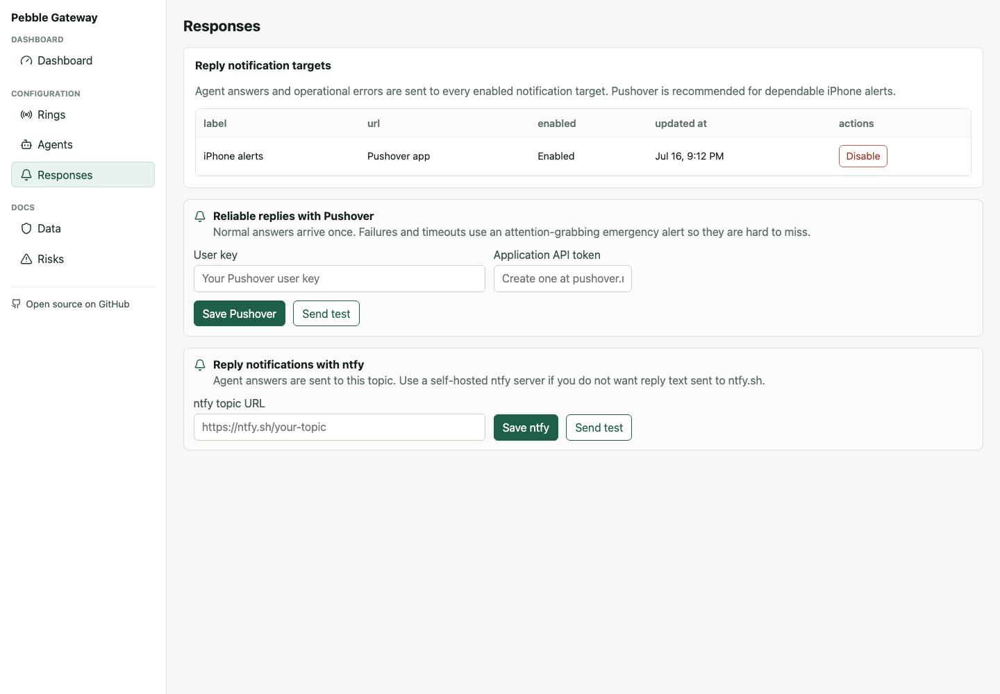
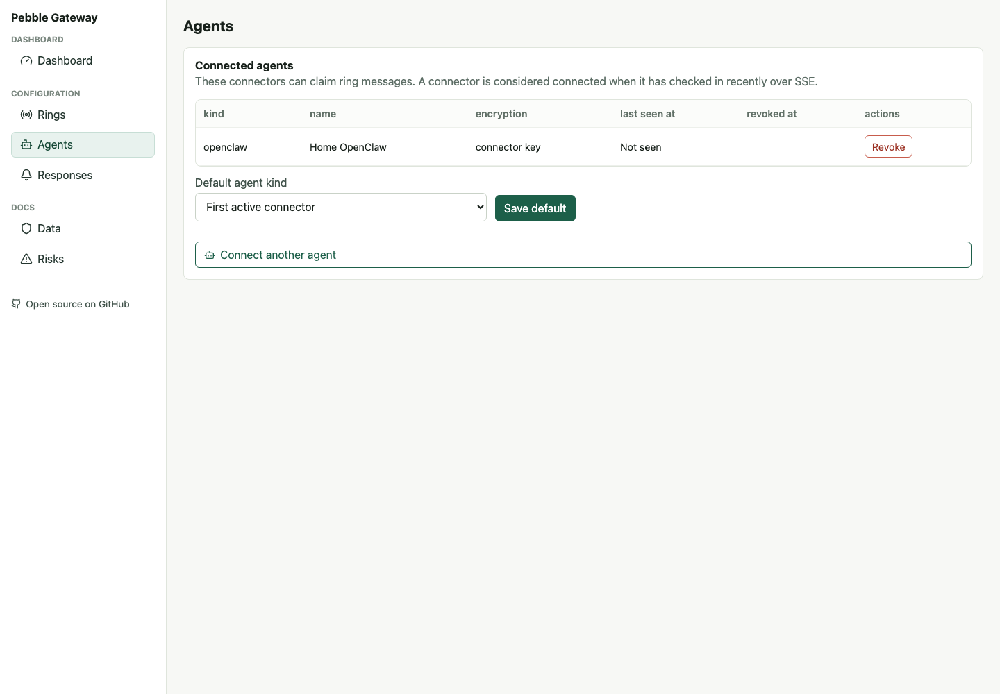

# Pebble Agent Gateway

Talk to your AI agent from a Pebble Index ring.

Pebble Agent Gateway is a small, open-source bridge that sends ring voice messages to AI agents running on your own machine. Agent answers come back as reliable phone notifications.

You configure the Pebble/CoreApp mobile app with a public webhook URL and token. When you send a voice message from the ring, the gateway receives it, routes it to a local connector, and the connector passes it to Codex, Claude, OpenClaw, or a simple CLI smoke-test runner. Agent answers return through Pushover or ntfy.

Source: https://github.com/sarfata/pebble-agent-gateway



## Fastest path: use the free hosted relay

The shared relay at **https://pebble-agent-gateway.fly.dev** is currently free for personal, reasonable-use setups. Create an account there, follow the five setup steps, and run the connector on your own computer. You do not need a Fly.io account or a public server.

The hosted service is an early community offering, not a paid SLA: availability and limits may change, and abusive or unusually heavy use may be restricted. Your local AI credentials and tools remain on your computer. The relay handles the webhook and encrypted short-lived queue; read [Privacy Model](#privacy-model) before deciding whether the hosted trust model fits you.

Prefer complete control? The project remains fully self-hostable with Tailscale Funnel, Docker, or your own Fly.io app.

## Architecture

There are two pieces:

1. A relay gateway with a public HTTPS URL.
2. An agent connector running on your machine.

The relay can be:

- **Our hosted Fly.io relay**, the quickest free setup for most people.
- **Mac + Tailscale Funnel**, the easiest personal setup. Follow [Run on a Mac with Tailscale](deploy/tailscale-funnel.md).
- **Fly.io**, which keeps the relay online when your Mac sleeps. Follow [Deploy the gateway to Fly.io](deploy/fly-io.md).

You do not need to understand webhooks, SQLite, or encryption to get started. The dashboard walks you through linking the ring and connecting an agent.

The agent connector runs locally where your agent already has access: inside your code checkout for Codex, on your workstation for Claude, or beside your OpenClaw workflows. It opens an outbound SSE connection to the relay, claims pending deliveries, runs the local agent command, acknowledges the delivery, and sends the answer back to the relay for a Pushover or ntfy notification.

The relay does not need inbound access to your laptop. Your machine connects out to it.

## Privacy Model

By default, message contents are not stored in plaintext at rest.

Pending messages are encrypted before they are written to SQLite. When a connector public key is configured, each pending delivery is encrypted to that key and decrypted locally by the connector. If no connector key is configured, the gateway encrypts the pending delivery with `APP_ENCRYPTION_KEY` and decrypts it during claim.

When a connector claims a delivery, the encrypted payload is deleted from the active queue. If no connector claims it within the configured TTL, the payload is deleted, the message is marked expired, and the gateway sends an error through every configured response channel.

The dashboard keeps metadata-only activity logs: timestamps, delivery status, target connector type, payload size, latency, and error codes. Transcripts and audio are not retained unless debug mode is explicitly enabled.

Important limitation: the gateway receives plaintext during webhook processing unless mobile-side end-to-end encryption is enabled. The default guarantee is encrypted short-term storage and metadata-only logs, not full end-to-end encryption.

## Configure With The Web UI

The web app starts with a guided setup:

1. Link your ring by creating a ring token and configuring CoreApp's Webhook URL and Auth Token fields.
2. Confirm the ring works by sending a test message and watching the metadata-only delivery status.
3. Configure Pushover (recommended) or ntfy replies, connect a local agent connector, and confirm it claims and answers a delivery.
4. Choose how to keep the connector running long term.

You can return to the website to connect another agent, inspect metadata-only activity and usage stats, configure response notifications, or check the data protection and risk notes.



### What the dashboard and admin account are for

The dashboard is the control panel for one account. It creates and revokes ring and connector tokens, configures routing and response notifications, and shows metadata-only diagnostics. It does **not** run your agent; the connector on your own computer does that.

On a fresh self-hosted installation, the first account is marked `admin`. Today that role simply identifies the instance owner and reserves a place for future instance-wide controls. It does not expose other users' transcripts or grant cross-account access; rings, connectors, response targets, and activity remain scoped to their owner. For a private single-user deployment, set `SIGNUPS_ENABLED=false` after creating that first account.

## Configure CoreApp Manually

Create a ring in the dashboard. In CoreApp, open Index Settings, tap Webhook, and enter:

```text
Webhook URL: https://your-gateway.example.com/api/ring/ingest
Auth Token:  ri_live_...
Send:        Transcription only
Trigger:     Double click & hold
```

The current CoreApp webhook sends:

```text
Content-Type: multipart/form-data
X-Widget-Token: ri_live_...
fields: audio, transcription, recordedAt, client
```

The gateway also accepts `Authorization: Bearer`, `X-Pebble-Token`, `X-Webhook-Token`, direct form token fields, and `?token=` for compatibility.

## Connect An Agent

Optionally generate a local connector key. This is recommended: the private key stays on your machine, and the dashboard only receives the public key, so queued payloads are encrypted to your connector.

```bash
pnpm --package github:sarfata/pebble-agent-gateway dlx pebble-agent-cli keygen
```

You can also leave the public key blank when creating a connector. In that mode the gateway encrypts pending messages at rest with `APP_ENCRYPTION_KEY`, decrypts them during claim, and still deletes the stored ciphertext on claim or expiry. This is easier to set up, but weaker than connector-side encryption because the gateway can decrypt pending messages.

Create a connector in the dashboard with kind `codex`, `claude`, `openclaw`, or `cli`, then copy the one-time `ag_live_...` token. You can run a connector without cloning this repo:

```bash
pnpm --package github:sarfata/pebble-agent-gateway dlx pebble-agent-cli listen --server https://your-gateway.example.com --token ag_live_... --agent print
```

Smoke test without invoking an external agent:

```bash
pnpm --package github:sarfata/pebble-agent-gateway dlx pebble-agent-cli listen --server https://your-gateway.example.com --token ag_live_... --agent print
```

Run a real local agent connector:

```bash
pnpm --package github:sarfata/pebble-agent-gateway dlx pebble-agent-cli listen --server https://your-gateway.example.com --token ag_live_... --agent codex
pnpm --package github:sarfata/pebble-agent-gateway dlx pebble-agent-cli listen --server https://your-gateway.example.com --token ag_live_... --agent claude
pnpm --package github:sarfata/pebble-agent-gateway dlx pebble-agent-cli listen --server https://your-gateway.example.com --token ag_live_... --agent openclaw
```

Agent output is sent back to the gateway by default. If Pushover or ntfy is configured, the answer appears there. Use `--no-send-reply` to disable replies or `--reply "fixed text"` to send a fixed reply instead of the local agent output.

Customize the prompt passed to Codex, Claude, or OpenClaw with `-p`:

```bash
pnpm --package github:sarfata/pebble-agent-gateway dlx pebble-agent-cli listen --server https://your-gateway.example.com --token ag_live_... --agent claude -p 'Handle this voice request carefully:

{{transcript}}

Reply with the outcome and any next step.'
```

Supported prompt placeholders are `{{transcript}}`, `{{recorded_at}}`, `{{event_id}}`, `{{ring_id}}`, and `{{source_message_id}}`.

Default local commands:

```text
codex:    codex exec "{{prompt}}"
claude:   claude -p "{{prompt}}"
openclaw: openclaw agent --agent main --message "{{prompt}}"
```

Override command shapes with:

```bash
PEBBLE_CODEX_COMMAND=codex
PEBBLE_CODEX_ARGS_JSON='["exec","{{prompt}}"]'
PEBBLE_CLAUDE_COMMAND=claude
PEBBLE_CLAUDE_ARGS_JSON='["-p","{{prompt}}"]'
PEBBLE_OPENCLAW_COMMAND=openclaw
PEBBLE_OPENCLAW_ARGS_JSON='["agent","--agent","main","--message","{{prompt}}"]'
```

By default each delivery is a one-shot invocation. Claude and OpenClaw also support a local context channel:

```bash
pnpm --package github:sarfata/pebble-agent-gateway dlx pebble-agent-cli listen --server https://your-gateway.example.com --token ag_live_... --agent claude --channel local-context
```

This stores recent transcripts and agent replies on the connector machine in `~/.config/pebble-agent-gateway/conversation.json` and includes them in future prompts. Use the default `--channel oneshot` if you do not want local history retained.

For long-term use, run the connector under tmux, screen, launchd, systemd, Docker, or another process supervisor. If the connector keeps an SSE connection open on Fly.io, the Machine remains active.

## Self-Host With Docker

```bash
cp deploy/.env.example deploy/.env
docker compose -f deploy/docker-compose.yml up --build
```

SQLite is stored in the mounted `/data` volume at `/data/gateway.sqlite`.

For a public HTTPS URL, continue with either [Tailscale Funnel](deploy/tailscale-funnel.md) or [Fly.io](deploy/fly-io.md).

## Pushover Replies (Recommended)

Pushover is the recommended phone notification path because it supports prominent, acknowledged emergency alerts for failures and timeouts:

1. Install Pushover and copy your user key from [pushover.net](https://pushover.net/).
2. Create an application such as “Pebble Agent Gateway” at [pushover.net/apps/build](https://pushover.net/apps/build) and copy its API token.
3. Open **Responses** in the gateway dashboard, enter both values, save, and use **Send test**.

Normal agent answers use standard priority. Connector failures and timeouts use emergency priority so they repeat until acknowledged. Pushover credentials are encrypted at rest and are never returned by the dashboard API after saving. Reply text is sent to Pushover for delivery but is not retained by the gateway by default.

## ntfy Replies (Optional)

Add an ntfy topic URL during Setup or in Settings, then use **Send test** to confirm the notification path. Agent replies are posted to that ntfy endpoint, but reply text is not stored by the gateway by default.

If a routed message expires, the gateway deletes the pending payload and sends an error through the configured response channels. If the local agent command fails or produces no response within two minutes by default, the connector sends a human-readable error through the same reply path.

Replies sent through ntfy are delivered to your configured ntfy server. Use a self-hosted ntfy server if you do not want reply text sent to ntfy.sh.

## Security Notes

Raw bearer tokens are displayed only at creation and stored only as hashes. Revoke a ring if the ring is lost or someone else can trigger it. Revoke an agent if its token or local machine is compromised.

SQLite WAL may retain historical ciphertext bytes until checkpointing. The privacy guarantee is that plaintext message contents are never written to normal SQLite tables and active ciphertext is removed on claim or expiry.

Treat voice transcripts as untrusted external input. Do not configure local agents to execute shell commands blindly from voice input.

## Environment Variables

```env
PUBLIC_BASE_URL=https://example.com
DATABASE_URL=file:/data/gateway.sqlite
SESSION_SECRET=...
TOKEN_PEPPER=...
APP_ENCRYPTION_KEY=...
MESSAGE_RETENTION_MODE=encrypted_ephemeral
MESSAGE_TTL_MINUTES=60
DELETE_PAYLOAD_ON_CLAIM=false
DEBUG_RETENTION=false
SIGNUPS_ENABLED=true
NTFY_ENABLED=true
```

## Development

```bash
corepack enable
pnpm install
pnpm test
pnpm build
pnpm --filter @pebble/gateway dev
```

Open `http://localhost:3000`, sign up, and follow Setup.

## Roadmap

- Pebble mobile-app QR setup PR
- Deeper Codex, Claude, and OpenClaw native integrations
- Time-limited debug-retention controls in the dashboard
- Optional reliability mode with delete-on-ack
- Optional Postgres adapter after the SQLite MVP
